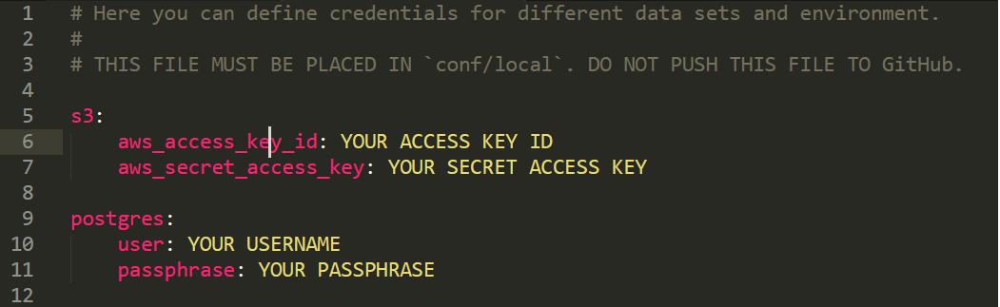

# Quantifying Traffic Dynamics from Traffic Videos 
We present an automated traffic analysis system. Our system which uses computer vision approaches to classify vehicles. For each vehicle type, it outputs  vehicles counts,  vehicle start counts, and vehicle stop counts.

## Table of Contents

1. [Introduction](#introduction)
2. [Code Overview](#code-overview)
3. [Repo Structure](#repo-structure)
4. [Contributors and Partners](#contributors-and-partners)
5. [License](#license)

## Introduction

Better insight extraction from traffic data can aid the effort to understand/reduce air pollution, and allow dynamic traffic flow optimization. Currently, traffic statistics (counts of vehicle types, stops, and starts) are obtained through high-cost manual labor (i.e. individuals counting vehicles by the road) and are extrapolated to annual averages. Furthermore, they are not detailed enough to evaluate traffic/air pollution initiatives. 

The purpose of the project is to create an open-source library to automate the collection of live traffic video data, and extract descriptive statistics (counts, stops, and starts by vehicle type)  using computer vision techniques. With this library, project partners will be able to input traffic camera videos, and obtain real-time traffic statistics which are localized to the level of individual streets. 

More details about the project goals, our technical approach, and the evaluation of our models can be found in the **Technical Report**. 

## Code Overview
### Installation and setup

#### Required software
This project requires *Python 3.7* or later, with packages as specified in requirements.txt. You should also have a package manager such as `pip3` or `conda`. 

*PostgreSQL* for storing intermediate model results, statistics outputted by the model, and evaluation results. We used version 9.5.19. 

*AWS S3 buckets* to store video data, neural network weights, and labelled videos data / their corresponding annotations files.

#### Optional software 
*CUDA for using GPUs:* The `YoloV3` object detection model can be run on GPU for speed improvements. During development, we utilized the AWS Ubuntu Deep Learning AMI (Version 23.1), which used CUDA 9.0.

#### Other services 
*Computer Vision Annotation Tool (CVAT)*: We used version 0.4.2 to annotate traffic videos for evaluation. Instructions on installing and running CVAT can be found on their [website](https://github.com/opencv/cvat/blob/develop/cvat/apps/documentation/installation.md#windows-10).

*Docker / Docker Toolbox for running a docker container that contains CVAT:* See their website for more details. 

#### Setup 
 1. Set Python 3.6 as a `PATH` environment variable: 
		- [Instructions for Windows](https://geek-university.com/python/add-python-to-the-windows-path/) (adapt instructions for Python 3.6 rather than Python 3.4)
		- On Linux/Ubuntu systems: 
		
			 a) Type `which python3.6`  into the terminal to get the path to your Python executable. You should get something like `/usr/local/bin/python3.6`. 
			 
			 b) Add the following line to the end of your `~/.bashrc` file: `export PYTHONPATH=$PYTHONPATH: your_python_path`, substituting the result of the `which` command above for your_python_path		
				   
2. Clone this repository into desired directory using the bright green `Clone or download` dropdown button  at the top right side of the homescreen of this repository. See [link](https://help.github.com/en/articles/cloning-a-repository) for help with this step. 
3. Enter your cloned copy of this repository using the terminal.
4. Install packages. 
	- If you have package manager `pip3`, run the terminal command `pip3 install -r requirements.txt`. 
5. Create a file to store S3 and PSQL database credentials at `air_pollution_estimation\conf\local\credentials.yml`. This file should be formatted as follows: 
 <p float="left">
  
</p> 

6. Edit the configuration files  in `air_pollution_estimation\conf\base\`. Here you should specify the name of your S3 bucket, paths to video data in your S3 bucket, paths to annotations in the S3 bucket, and the names of the PSQL tables you would like to write to. See sections **Configuration Files** and **Sample S3 Structure** for more details. 
7. (Optional) If you wish to use the GOTURN tracker with the pipelines, please follow the instructions at this [link](https://www.learnopencv.com/goturn-deep-learning-based-object-tracking/) to  download/unzip the files. Place the unzipped model files in the directory `air_pollution_estimation\src\`. 

#### Sample S3 Structure 
THE BELOW FIGURE NEEDS TO BE UPDATED
<p float="left">
  
</p> 
Current settings in `air_pollution_estimation/conf/base/` are configured to work with an S3 bucket with the following folder structure: 

```
├── air-pollution-uk/
│   ├── raw/
│   │   ├── videos/
│   │   │   ├── 2019-08-13/
│   │   │   |    ├── "date-time_cameraid.mp4"
│   │   │   |    ├── ...
│   │   │   ├── 2019-08-14/
│   │   │   └──  ...
│   ├── ref/
│   │   ├── video_names/
│   │   │   ├── "video_list1.json"
│   │   │   └──  ...
│   │   ├── annotations/
│   │   │   ├── cvat/
│   │   │   └──  detrac/
│   │   ├── camera_details/
│   │   ├── model_conf/
│   │   │   ├── yolov3-tiny/
│   │   │   ├── yolov3/
│   │   │   └── yolov3_traffic/
│   ├── frame_level/
│   │   ├── ...
│   ├── processed_data/
│   │   └──  ...
│   └──
└──   
```

If you wish to utilize this library with an alternate S3 structure, you must change the appropriate paths in `paths.yml`. See **Configuration Files** for more details. 

#### Configuration Files
System specifications such as model parameters and file paths are contained in `YAML` configuration files found in `air_pollution_estimation/conf/base/`. In the various pipelines in the folder `air_pollution_estimation/src/`, our system reads the conf files from the aforementioned directory into dictionaries. 

Stored in this `air_pollution_estimation/conf/base/`directory are the following config files: 
* `app_parameters.yml` contains configuration options for the web app.
* `paths.yml` contains: 
	* Relevant file paths for input files (from the S3 bucket)
	* Table names for the PSQL database (to store output statistics and evaluation statistics)
	* Paths for temp folders used for temporary downloading/uploading of data. Folders are automatically created/deleted by the pipelines at these paths.
* `parameters.yml` defines: 
	* Various hyperparameters for detection and tracking
	* Configuration options for reporting.

We recommend that credentials be stored in a git-ignored `YAML` file in `air_pollution_estimation/conf/local/credentials.yml`.
* `credentials.yml` should contain credentials necessary for accessing the PostgreSQL database, and Amazon AWS services.

#### Running the pipelines
Once the above setup has been completed, you can deploy any of the pipelines (see **Repo Structure**) by running the following terminal command from the `air_pollution_estimation` folder:

```python3 src\name_of_pipeline.py```

**TODO: IMPLEMENT THIS**
If you haven't yet set up your S3 bucket or PSQL database--don't worry! We've created a toy pipeline which reads in  example videos from the 
`air_pollution_estimation\data\` folder, and prints output to the terminal. As above, simply run: 

```python3 src\toy_pipeline.py```

## Repo Structure 
Below is a partial overview of our repository tree: 

```
├── conf/
│   ├── base/
│   └── local/
├── data/
│   ├── frame_level/
│   ├── raw/
│   ├── ref/
│   │   ├── annotations/
│   │   ├── detection_model/
│   │   └── video_names/
│   └── temp/
│       └── videos/
├── notebooks/
├── requirements.txt
└── src/
    ├── create_dev_tables.py
    ├── data_collection_pipeline.py
    ├── eval_pipeline.py
    ├── run_pipeline.py
    ├── traffic_analysis/
    │   ├── d00_utils/
    │   │   ├── create_sql_tables.py
    │   │   ├── data_loader_s3.py
    │   │   ├── data_loader_sql.py
    │   │   ├── data_retrieval.py
    │   │   ├── load_confs.py
    │   │   ├── ...
    |   |   └── ...
    │   ├── d01_data/
    │   │   ├── collect_tims_data_main.py
    │   │   ├── collect_tims_data.py
    │   │   ├── collect_video_data.py
    |   |   └── ...
    │   ├── d02_ref/
    │   │   ├── download_detection_model_from_s3.py
    │   │   ├── load_video_names_from_s3.py
    │   │   ├── ref_utils.py
    │   │   ├── retrieve_and_upload_video_names_to_s3.py
    │   │   └── upload_annotation_names_to_s3.py
    │   ├── d03_processing/
    │   │   ├── create_traffic_analyser.py
    │   │   ├── update_eval_tables.py
    │   │   ├── update_frame_level_table.py
    │   │   └── update_video_level_table.py
    │   ├── d04_modelling/
    │   │   ├── classify_objects.py
    │   │   ├── object_detection.py
    │   │   ├── perform_detection_opencv.py
    │   │   ├── perform_detection_tensorflow.py
    │   │   ├── tracking/
    │   │   │   ├── tracking_analyser.py
    │   │   │   └── vehicle_fleet.py
    │   │   ├── traffic_analyser_interface.py
    │   │   └── transfer_learning/
    │   │       ├── convert_darknet_to_tensorflow.py
    │   │       ├── generate_tensorflow_model.py
    │   │       └── tensorflow_detection_utils.py
    │   ├── d05_evaluation/
    │   │   ├── chunk_evaluator.py
    │   │   ├── compute_mean_average_precision.py
    │   │   ├── frame_level_evaluator.py
    │   │   ├── parse_annotation.py
    │   │   ├── report_yolo.py
    │   │   └── video_level_evaluator.py
    └── traffic_viz/
        ├── d06_visualisation/
        │   ├── chunk_evaluation_plotting.py
        │   ├── dash_object_detection/
        │   │   ├── app.py
        │   │   └── ...
        │   └── 
        └──
```
#### Data collection pipeline

#### Video analysis pipeline
*Main tasks: get videos from S3, initialize model, run model to construct frame level dataframes (bounding box positions) and video level dataframes of traffic statistics (counts, starts/stops).*

#####  Modelling overview: 

All models should inherit from the TrafficAnalyserInterface. The TrafficAnalyserInterface requires that any child classes implement  construct_frame_level_df() and construct_video_level_df() methods. 

- Version 1: YOLO object detection only  
- Version 2: YOLO objects detection with tracking 

#### Evaluation pipeline

- ChunkEvaluator is implemented using SingleEvaluator
- Frame level evaluation — mean average precision
- Video level evaluation  —mean/std dev difference, mean squared error 

#### Web App

## Contributors and Partners

<p float="left">
  
</p> 

### Data Science for Social Good at Imperial College London
**Our team**: Jack Hensley, Oluwafunmilola Kesa, Sam Blakeman, Caroline Wang, Sam Short (Project Manager), Maren Eckhoff (Technical Mentor)

**Data Science for Social Good (DSSG)** summer fellowship is a 3-months long educational program of Data Science for Social Good foundation and the University of Chicago, where it originally started. In 2019, the program is organized in collaboration with the Imperial College Business School London, and Warwick University and Alan Turing Institute. Two cohorts of about 20 students each are hosted in these institutions where they are working on projects with our partners. 
The mission of the summer fellowship program is to train aspiring data scientists to work on data mining, machine learning, big data, and data science projects with social impact, with a special focus on the ethical consequences of the tools and systems they build. Working closely with governments and nonprofits, fellows take on real-world problems in education, health, energy, public safety, transportation, economic development, international development, and more.


### Partners

- The **Transport and Environmental Laboratory** (Department of Civil and Environmental Engineering, Imperial College London) has a mission to advance the understanding of the impact of transport on the environment, using a range of measurement and modelling tools. 

- **Transport for London** (TFL) is an integrated transport authority under the Greater London Authority,  which runs the day-to-day operation of London’s public transport network and manages London’s main roads. TFL leads various air quality initiatives including the Ultra Low Emission Zone in Central London.

- **City of London Corporation** (CLC) is the governing body of the City of London (also known as the Square Mile), one of the 33 administrative areas into which London is divided. Improving air quality in the Square Mile is one of the major issues the CLC will be focusing on over the next few years. 

- The  **Alan Turing Institute** is the national institute for data science and artificial intelligence. Its mission is to advance world-class research in data science and artificial intelligence, train leaders of the future, and lead the public conversation. 

## License

Fill in later