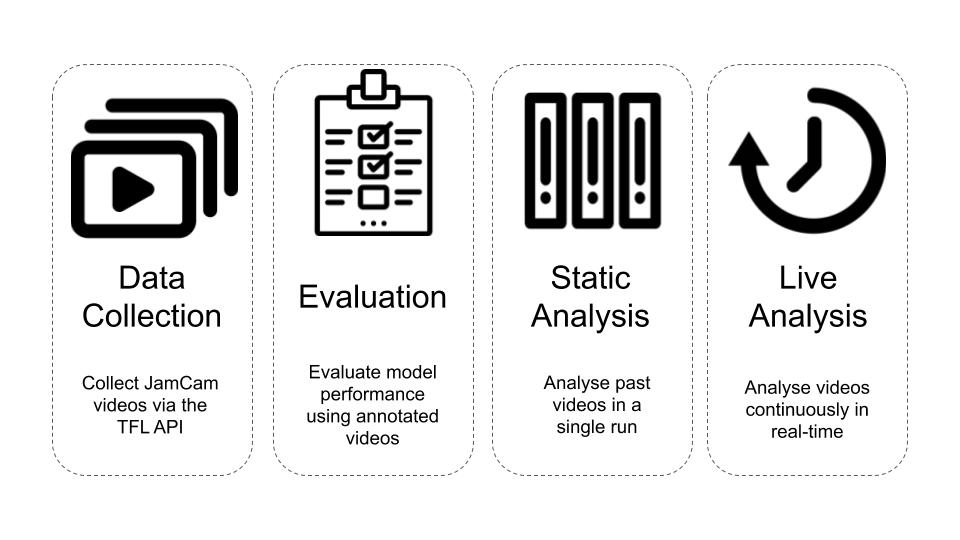

# Quantifying London Traffic Dynamics from Traffic Videos 
We present an automated traffic analysis library. Our library provides functionality to 
1. Collect real-time traffic videos from the Transport for London API 
2. Analyse collected videos using computer vision techniques to produce traffic statistics (vehicle counts, vehicle starts, vehicle stops)
3. Deploy a live web app to display collected statistics
4. Evaluate videos (given annotations)

## Table of Contents

1. [Introduction](#introduction)
2. [Code Overview](#code-overview)
3. [Installation and Setup](#installation-and-setup)
4. [Repo Structure](#repo-structure)
5. [Contributors and Partners](#contributors-and-partners)
6. [License](#license)

## Introduction

Better insight extraction from traffic data can aid the effort to understand/reduce air pollution, and allow dynamic traffic flow optimization. Currently, traffic statistics (counts of vehicle types, stops, and starts) are obtained through high-cost manual labor (i.e. individuals counting vehicles by the road) and are extrapolated to annual averages. Furthermore, they are not detailed enough to evaluate traffic/air pollution initiatives. 

The purpose of the project is to create an open-source library to automate the collection of live traffic video data, and extract descriptive statistics (counts, stops, and starts by vehicle type)  using computer vision techniques. With this library, project partners will be able to input traffic camera videos, and obtain real-time traffic statistics which are localized to the level of individual streets. 

More details about the project goals, our technical approach, and the evaluation of our models can be found in the **Technical Report**. 

## Overview
Our project is structured into four main pipelines, each of which serves a disctinct function. These pipelines are broadly described as follows:

<p float="left">
  
</p> 

## Infrastructure

All pipelines were run on an AWS EC2 instance and a combination of an AWS S3 bucket and PostgreSQL database were used to store data. The details of the EC2 instance can be found below:
```
AWS EC2 Instance Information
+ AMI: ami-07dc734dc14746eab, Ubuntu image
+ EC2 instance: c4.4xlarge
    + vCPU: 16
    + RAM: 30 GB
+ OS: ubuntu 18.04 LTS
+ Volumes: 1
    + Type: gp2
    + Size: 100 GB
+ RDS: No
```
#TODO Check these details with Lily

## Installation and setup

### Setting up Ubuntu

For installation and setup we are assuming that you are on a Ubuntu system. To start with you should update and upgrade your apt-get package manager.

```
sudo apt-get update
sudo apt-get upgrade -y
```
Now you can install python 3.6 and the corresponding pip version. To do this run the following commands in order:
```
sudo apt-get install python3.6
sudo apt-get install python3-pip
sudo apt-get install python3.6-dev
```

### Setting Up A Virtual Environment

The next step is to set up a virtual environment for managing all the packages needed for this project. Run the following commands to install virtualenv:
```
python3.6 -m pip install virtualenv
```
With virtualenv installed we can now create a new environment for our packages. To do this we can run the following commands (where 'my_env' is your chosen name for the environment):
```
python3.6 -m virtualenv my_env
```
Whenever you want to run our pipelines you need to remember to activate this environment so that all the necessary packages are present. To do this you can run the command below: 
```
source my_env/bin/activate
```
Run this command now because in the next step we will clone the repo and download all the packages we need into the 'my_env' environment.

### Clone The Repo

To clone our repo and download all of our code run the following commands:
```
cd ~
git clone https://github.com/dssg/air_pollution_estimation.git
```

### Installing Packages

All of the required packages for this project are in the 'requirements.txt' file. To install the packages run the following commands:
```
cd air_pollution_estimation/
sudo apt-get install -y libsm6 libxext6 libxrender-dev libpq-dev
pip install -r requirements.txt
```

### Set Up Credentials File

With the repo cloned and the packages installed the next step is to create your private credentials file that will allow you to log into the different AWS services. To create the file run the following command:
```
touch conf/local/credentials.yml
```
With the file created, you need to use your preferred text editor (e.g. ```nano conf/local/credentials.yml```) to copy the following template into the file: 
```
dev_s3:
  aws_access_key_id: YOUR_ACCESS_KEY_ID_HERE
  aws_secret_access_key: YOUR_SECRET_ACCESS_KEY_HERE

email:
  address: OUTWARD_EMAIL_ADDRESS
  password: EMAIL_PASSWORD
  recipients: ['RECIPIENT_1_EMAIL_ADDRESS', 'RECIPIENT_2_EMAIL_ADDRESS', ...]

postgres:
  host: YOUR_HOST_ADDRESS
  name: YOUR_DB_NAME
  user: YOUR_DB_USER
  passphrase: YOUR_DB_PASSWORD
```
With the template copied, you need to replace the placeholder values with your actual credentials. The keys in `credentials.yml` are described below:
* `dev_s3`: This contains the Amazon S3 credentials. Learn more about setting up an Amazon S3 <a src="https://docs.aws.amazon.com/s3/index.html?nc2=h_ql_doc">here</a>
* `email`: The `email` parameter is used for email notification service. The email notification service is used to send warnings or messages to recipients when data collection fails.
  * `address`: the email address used to send a mail to the recipients
  * `password`: the password of the email address
  * `recipients`: the list of recipients(email addresses) to be notified

For the final setup step execute the following command to complete the required infrastructure:

``` python3 src/setup.py```

## 

## 1. Running The Data Collection Pipeline

In order to run the static pipeline you need to collect raw video data from the TFL API. **You therefore need to run the data collection pipeline before the static pipeline will work**. The data collection pipeline continuously grabs videos from the TFL API and puts them in the S3 bucket for future analysis. The longer you leave the data collection pipeline to run the more data you will have to analyse!

To run the pipeline you first need to set up your AWS credentials for the AWS command line tool. To do this run the following command:
```
aws configure --profile dssg
```
When prompted enter your AWS access key ID and your secret access key (these will be the same as the ones you entered in the ```credentials.yml``` file). For the default region name and output format just press enter to leave them blank.

You are now ready to run the data collection pipeline! Run the following command to run the pipeline: 
```
python3 src/data_collection_pipeline.py
```
As long as this process is running you will be downloading the latest JamCam videos and uploading them to the S3 bucket. The videos will be collected from all the camera and stored in folders based on their date of collection.

### Optional parameters for data collection pipeline
The optional parameters for the data collection pipeline include:

* `iterations`: The data collection pipeline script downloads videos from TFL continuously when `iterations` is set to `0`. To stop the data collection pipeline after ` N iterations`, change the `iterations` parameter in the `parameters.yml` to `N` where ```N``` is a number e.g

```
iterations: 4
```

* `delay`: The `delay` parameter is the amount of time in minutes for the data collection pipeline to wait between iterations. The default `delay` time is set to `3 mins` because TFL uploads new videos after `~4 mins`. E.g
```
delay: 3
```

## 2. Running The Static Pipeline

The static pipeline is used to analyse a selection of JamCam videos and put the results into the PostgreSQL database.  general outline of static pipeline can be seen in the following diagram:

<p float="left">
  
</p> 

In short, the pipeline first constructs a .json file containing a list of video file paths to be used for analysis. The video paths saved in the .json file are based on a particular search critera (see below). The .json file is uploaded to s3 so that we can avoid searching the videos every time we want to run the pipeline. The next step of the pipeline is to use the .json file to load the corresponding videos into memory and analyse them, producing frame and video level statistics in the PostgreSQL database.

Under 'static_pipeline' heading in the ```parameters.yml``` file is a collection of parameters that are used to control which videos are saved to the .json file. These parameters are as follows:

* `load_ref_file` - Boolean for flagging whether to create a new .json file or load an existing one
* `ref_file_name` - The name of the ref file that will be saved and/or loaded
* `camera_list` - A list of camera IDs specifying the camera to analyse
* `from_date` - The date to start analysing videos from
* `to_date` - The date to stop analysing videos from
* `from_time` - The time of day to start analysing videos from
* `to_time` - THe time of day to stop analysing videos from

To edit these parameters you can use your favourite text editor e.g. (e.g. `nano conf/local/credentials.yml`). Remember this pipeline assumes that you have already collected videos that satisfy the requirements specified by your parameter settings.

If the search parameters are `None` then they default to the following:

* `camera_list` - Defaults to all of the cameras if `None`<br/>
* `from_date` - Defaults to `"2019-06-01"` if `None`<br/>
* `to_date` - Defaults to the current date if `None`<br/>
* `from_time` - Defaults to `"00-00-00"` if `None`<br/>
* `to_time` - Defaults to `"23-59-59"` if `None`

Aside from the parameters that define the search criteria for the videos to be analysed, there are a host of other parameters in ```parameters.yml``` that affect the static pipeline. These parameters can be found under the 'modelling' heading and are defined as follows:


#### obj detection
```detection_model``` - Specifies the type of object detection model used by the pipeline. Available values are: ```["yolov3-tiny_opencv", "yolov3_cv", "yolov3_tf", "traffic_tf"]```<br/>
```detection_iou_threshold``` - 0.05<br/>
```detection_confidence_threshold``` - 0.2<br/>
```detection_nms_threshold``` - 0.2

#### tracking
```selected_labels``` - ["car", "truck", "bus", "motorbike"]<br/>
```opencv_tracker_type``` - "CSRT"<br/>
```iou_threshold``` - 0.05 #controls how much two objects' bboxes must overlap to be considered the "same"<br/>
```detection_frequency``` - 4<br/>
```skip_no_of_frames``` - 3

#### stop starts
```iou_convolution_window``` - 15<br/>
```smoothing_method``` - "moving_avg"<br/>
```stop_start_iou_threshold``` - 0.80

# TODO Describe all the other parameters

# TODO Need a GPU to run yolov3-tf

# TODO Have decent default parameter values

## 3. Running The Live Pipeline

The live pipeline integrates data collection with video analysis to provide real-time traffic statistics. Every 4 minutes the pipeline grabs the latest videos from the cameras listed in the ```parameters.yml``` file under ```data_collection: tims_camera_list:``` and analyses them. The results are stored in the frame-level and video-level tables in the PostgreSQL database.

To run the pipeline execute the following command in the terminal:

``` python3 src/live_pipeline.py```

## 4. Running The Evaluation Pipeline

The evaluation pipeline is used to evaluate the performance of different analyser models and their respective parameter settings. The pipeline relies on hand annotated videos from the computer software *Computer Vision Annotation Tool (CVAT)*. We used version 0.4.2 of CVAT to annotate traffic videos for evaluation. Instructions on installing and running CVAT can be found on their [website](https://github.com/opencv/cvat/blob/develop/cvat/apps/documentation/installation.md#windows-10). 

For each video, we labelled cars, trucks, buses, motorbikes, and vans; for each object labelled, we annotated whether it was stopped or parked. For consistency we used the following instructions to annotate ground-truth videos with the CVAT tool:

Use the video name as the task name so that it dumps with the same naming convention<br/>
- As a rule of thumb, label things inside the bottom 2/3rds of the image. But if a vehicle is very obvious in the top 1/3rd, label it.<br/>
- Use the following labels when creating a CVAT task:<br/>
vehicle ~checkbox=parked:false ~checkbox=stopped:false @select=type:undefined,car,truck,bus,motorbike,van<br/>
- Set Image Quality to 95<br/>
- Draw boxes around key frames and let CVAT perform the interpolation<br/>
- Press the button that looks like an eye to specify when the object is no longer in the image<br/>
- Save work before dumping task to an xml file.<br/>

Once you have the xml files containing your annotations you need to put them in your S3 bucket according to the path ```s3_annotations``` in the ```paths.yml``` file. It is important that you have the raw videos that corespond to these annotations in the S3 directory indicated by ```s3_video``` in the ```paths.yml``` file. These raw videos will be used by the pipeline to generate predictions that will then be evaluated against the annotations in the xml files. As an example of how the evaluation process works we use the ```setup.py``` script that you ran earlier to put some example videos and annotations in your S3 bucket so that the pipeline will run.

As our approach outputs both video level and frame level statistics, we perform evaluation on both the video level and the frame level. As our models did not produce statistics for vans or indicate whether a vehicle was parked, these statistics are omitted from the evaluation process. 

Video level evaluation is performed for all vehicle-types (cars, trucks, buses, motorbikes) and vehicle statistics (counts, stops, starts) produced by our model. For each combination of vehicle type and vehicle statistics (e.g. car counts, car stops, car starts) we computed the following summary statistics over the evaluation data set:

- Mean absolute error<br/>
- Root mean square error<br/>

As speed was a primary consideration for our project partners, we also evaluated the average runtime for each model. 

Frame level evaluation is performed for all vehicle types produced by our model. For each vehicle type and for each video, we compute the mean average precision. Mean average precision is a standard metric used by the computer vision community to evaluate the performance of object detection/object tracking algorithms. Essentially, this performance metric assesses both how well an algorithm detects existing objects as well as how accurately placed the bounding boxes around these objects are. 

In the context of our project, mean average precision could be utilized to interrogate video-level model performance and diagnose issues. However, as video level statistics were the primary deliverable to our project partners, we used video level performance to select the best models. 

Modifiable model parameters can be found in the ```parameters.yml``` file under ```modelling:```. A description of these parameters can be found in the above section (Static Pipeline).


#### Required software
This project requires *Python 3.6* or later, with packages as specified in requirements.txt. You should also have a package manager such as `pip3`. 

*PostgreSQL* for storing intermediate model results, statistics outputted by the model, and evaluation results. We used version 9.5.19. 

*AWS S3 buckets* to store video data, neural network weights, and labelled videos data / their corresponding annotations files.

#### Optional software 
*CUDA for using GPUs:* The `YoloV3` object detection model can be run on GPU for speed improvements. During development, we utilized the AWS Ubuntu Deep Learning AMI (Version 23.1), which used CUDA 9.0.

#### Other services 
*Computer Vision Annotation Tool (CVAT)*: We used version 0.4.2 to annotate traffic videos for evaluation. Instructions on installing and running CVAT can be found on their [website](https://github.com/opencv/cvat/blob/develop/cvat/apps/documentation/installation.md#windows-10).

*Docker / Docker Toolbox for running a docker container that contains CVAT:* See their website for more details. 

#### Set up machine 

1. Set up a Python 3.6 virtual environment to run our library in. This will help avoid package version conflicts.  
* [Windows 10 instructions](https://www.c-sharpcorner.com/article/steps-to-set-up-a-virtual-environment-for-python-development/)
* [Linux/Ubuntu instructions](https://www.linode.com/docs/development/python/create-a-python-virtualenv-on-ubuntu-1610/): follow instructions for Python 3, substituting in python3.6 whereever you are supposed to type 'python3'.

2. Activate the virtual environment (see links above).

 2. Set Python 3.6 as a `PYTHONPATH` system environment variable: 
    * [Instructions for Windows](https://www.tutorialspoint.com/How-to-set-python-environment-variable-PYTHONPATH-on-Windows) (adapt instructions for Python 3.6 rather than Python 2.7)
    * On Linux/Ubuntu systems: 
        
        * Type `which python3.6`  into the terminal to get the path to your current Python executable. You should get something like `/usr/local/bin/python3.6`. *Warning: if you have not activated your virtual environment, you will get the path to your base Python executable, rather than the path to your virtual environment's Python executable.*
             
        * Open your `~/.bashrc` file in editing mode using the command `nano ~/.bashrc`,  or the editor of your choice. 
        * Place the line `export PYTHONPATH=$PYTHONPATH: your_python_path` at the bottom of the file, substituting the result of the `which` command above for your_python_path     
                   
3. Clone this repository into desired directory using the bright green `Clone or download` dropdown button  at the top right side of the homescreen of this repository. See [link](https://help.github.com/en/articles/cloning-a-repository) for help with this step if required. 
4. Enter your cloned copy of this repository using the terminal command: 
``` cd air_pollution_estimation```. **All instructions from this point on are with the assumption that you are in the `air_pollution_estimation` directory.** 
5. Install the Python packages in the `requirements.txt`: 
    - If you have package manager `pip3`, run the terminal command `pip3 install -r requirements.txt`. 
6. Create a file to store S3 and PSQL database credentials at `conf/local/credentials.yml`. This file should be formatted as follows: 
```
dev_s3:
    aws_access_key_id: YOUR_SECRET_ACCESS_ID
    aws_secret_access_key: YOUR_SECRET_ACCESS_KEY
postgres:
    user: YOUR_USERNAME
    passphrase: YOUR_PASSPHRASE
```
 Tip:  you can create/edit a file from the command line using 

```
nano air_pollution_estimation/conf/local/credentials.yml
```

8. Edit the config file  `conf/base/paths.yml`. Change the following variables:
* `s3 paths`: 
    * `bucket_name`: specify name of your S3 bucket
    * `s3_profile`: specify the name of your AWS profile here

* `db_paths`:
    * `db_host`: specify PSQL database host link   
    * `db_name`: specify the name of your database 

See section **Configuration Files**  for more details. 

  ***Don't have an S3 bucket or a database ?*** *To be implemented*
Don't worry--you can still try out our code! We've created a toy pipeline which reads in  example videos from the 
`data/` folder, and prints output to the terminal. 
Simply run:
```
python3 src/toy_pipeline.py
```
The following sections are a walk-through of how to run our pipelines (which collect live traffic videos, run analysis at scale, or run evaluation). To continue, you will need an S3 bucket and PSQL database. 

9.  Run `python3 src/setup.py`. This file uploads model weights to the S3 bucket, downloads camera meta data, and creates the PSQL tables used to store the output of our traffic video analysis pipeline.  
10. (Optional setup) If you wish to use the GOTURN tracker with the pipelines, please follow the instructions at this [link](https://www.learnopencv.com/goturn-deep-learning-based-object-tracking/) to  download/unzip the files. Place the unzipped model files in the directory `air_pollution_estimation\src\`. 

#### Running the pipelines one-off
Once the above setup has been completed, you should deploy the pipelines in the following order. 

1. Data collection pipeline: this pipeline queries the Transport for London (TFL) JamCam API for videos from all 911 traffic cameras, every 4 seconds. It then uploads these videos to the S3 bucket. 

    * Set the number of iterations you wish to run the pipeline by specifying the `iterations` parameter in the `parameters.yml`. 
        
    * To deploy pipeline, type the following into the command line:
        
      ```python3 src\data_collection_pipeline.py```
2. Analysis pipeline: this pipeline gets videos from the S3 bucket for a specified range of dates/times, and a specified set of cameras. It runs our model on these videos, and appends the results to the PSQL tables.     

    * If running for the first time, you will need to edit `src/run_pipeline.py`. Specify the date/time ranges and specify the camera IDs for which you would like to get videos from the S3 bucket, by changing the arguments of `retrieve_and_upload_video_names_to_s3()`. This generates a `.json` of video paths in the S3 bucket which satisfy your requirements, and saves it for future use. On subsequent runs of the pipeline you can comment out `retrieve_and_upload_video_names_to_s3()` and just load the video names directly from the `.json` on S3.
    * This pipeline relies on data collected by the `data_collection_pipeline.py`, so if you have not collected data for your specified ranges/camera IDs, the analysis cannot run.
    *  To deploy pipeline, type the following into the command line:
      ```python3 src\run_pipeline.py```
3. Running the evaluation pipeline 
    * If you want to run the evaluation pipeline and see how well the model does on CVAT-annotated data, copy annotation `.xml` files into `your-bucket-name/ref/annotations/cvat/`. You will need to ensure that the annotation files are named in the same way as the raw videos (YYYYMMDD-HHMMSS_CAMERAID e.g. 20190815-020929_00001.03748).


 
## Repo Structure 

<p float="left">
  
</p> 

Below is a partial overview of our repository tree: 

```
├── conf/
│   ├── base/
│   └── local/
├── data/
│   ├── frame_level/
│   ├── raw/
│   ├── ref/
│   │   ├── annotations/
│   │   ├── detection_model/
│   │   └── video_names/
│   └── temp/
│       └── videos/
├── notebooks/
├── requirements.txt
└── src/
    ├── create_dev_tables.py
    ├── data_collection_pipeline.py
    ├── eval_pipeline.py
    ├── run_pipeline.py
    ├── traffic_analysis/
    │   ├── d00_utils/
    │   │   ├── create_sql_tables.py
    │   │   ├── data_loader_s3.py
    │   │   ├── data_loader_sql.py
    │   │   ├── data_retrieval.py
    │   │   ├── load_confs.py
    │   │   ├── ...
    |   |   └── ...
    │   ├── d01_data/
    │   │   ├── collect_tims_data_main.py
    │   │   ├── collect_tims_data.py
    │   │   ├── collect_video_data.py
    |   |   └── ...
    │   ├── d02_ref/
    │   │   ├── download_detection_model_from_s3.py
    │   │   ├── load_video_names_from_s3.py
    │   │   ├── ref_utils.py
    │   │   ├── retrieve_and_upload_video_names_to_s3.py
    │   │   └── upload_annotation_names_to_s3.py
    │   ├── d03_processing/
    │   │   ├── create_traffic_analyser.py
    │   │   ├── update_eval_tables.py
    │   │   ├── update_frame_level_table.py
    │   │   └── update_video_level_table.py
    │   ├── d04_modelling/
    │   │   ├── classify_objects.py
    │   │   ├── object_detection.py
    │   │   ├── perform_detection_opencv.py
    │   │   ├── perform_detection_tensorflow.py
    │   │   ├── tracking/
    │   │   │   ├── tracking_analyser.py
    │   │   │   └── vehicle_fleet.py
    │   │   ├── traffic_analyser_interface.py
    │   │   └── transfer_learning/
    │   │       ├── convert_darknet_to_tensorflow.py
    │   │       ├── generate_tensorflow_model.py
    │   │       └── tensorflow_detection_utils.py
    │   ├── d05_evaluation/
    │   │   ├── chunk_evaluator.py
    │   │   ├── compute_mean_average_precision.py
    │   │   ├── frame_level_evaluator.py
    │   │   ├── parse_annotation.py
    │   │   ├── report_yolo.py
    │   │   └── video_level_evaluator.py
    └── traffic_viz/
        ├── d06_visualisation/
        │   ├── chunk_evaluation_plotting.py
        │   ├── dash_object_detection/
        │   │   ├── app.py
        │   │   └── ...
        │   └── 
        └──
```

#### Configuration Files
System specifications such as model parameters and file paths are contained in `YAML` configuration files found in `air_pollution_estimation/conf/base/`. In the various pipelines in the folder `air_pollution_estimation/src/`, our system reads the conf files from the aforementioned directory into dictionaries. 

Stored in this `air_pollution_estimation/conf/base/`directory are the following config files: 
* `app_parameters.yml` contains configuration options for the web app.
* `paths.yml` contains: 
    * Relevant file paths for input files (from the S3 bucket)
    * Table names for the PSQL database (to store output statistics and evaluation statistics)
    * Paths for temp folders used for temporary downloading/uploading of data. Folders are automatically created/deleted by the pipelines at these paths.
* `parameters.yml` defines: 
    * Various hyperparameters for detection and tracking
    * Configuration options for reporting.

We recommend that credentials be stored in a git-ignored `YAML` file in `air_pollution_estimation/conf/local/credentials.yml`.
* `credentials.yml` should contain credentials necessary for accessing the PostgreSQL database, and Amazon AWS services.

#### Data collection pipeline

#### Video analysis pipeline
*Main tasks: get videos from S3, initialize model, run model to construct frame level dataframes (bounding box positions) and video level dataframes of traffic statistics (counts, starts/stops).*

#####  Modelling overview: 

All models should inherit from the TrafficAnalyserInterface. The TrafficAnalyserInterface requires that any child classes implement  construct_frame_level_df() and construct_video_level_df() methods. 

- Version 1: YOLO object detection only  
- Version 2: YOLO objects detection with tracking 

#### Evaluation pipeline

- ChunkEvaluator is implemented using SingleEvaluator
- Frame level evaluation — mean average precision
- Video level evaluation  —mean/std dev difference, mean squared error 

#### Web App

## Contributors and Partners

<p float="left">
  
</p> 

### Data Science for Social Good at Imperial College London
**Our team**: Jack Hensley, Oluwafunmilola Kesa, Sam Blakeman, Caroline Wang, Sam Short (Project Manager), Maren Eckhoff (Technical Mentor)

**Data Science for Social Good (DSSG)** summer fellowship is a 3-months long educational program of Data Science for Social Good foundation and the University of Chicago, where it originally started. In 2019, the program is organized in collaboration with the Imperial College Business School London, and Warwick University and Alan Turing Institute. Two cohorts of about 20 students each are hosted in these institutions where they are working on projects with our partners. 
The mission of the summer fellowship program is to train aspiring data scientists to work on data mining, machine learning, big data, and data science projects with social impact, with a special focus on the ethical consequences of the tools and systems they build. Working closely with governments and nonprofits, fellows take on real-world problems in education, health, energy, public safety, transportation, economic development, international development, and more.


### Partners

- The **Transport and Environmental Laboratory** (Department of Civil and Environmental Engineering, Imperial College London) has a mission to advance the understanding of the impact of transport on the environment, using a range of measurement and modelling tools. 

- **Transport for London** (TFL) is an integrated transport authority under the Greater London Authority,  which runs the day-to-day operation of London’s public transport network and manages London’s main roads. TFL leads various air quality initiatives including the Ultra Low Emission Zone in Central London.

- **City of London Corporation** (CLC) is the governing body of the City of London (also known as the Square Mile), one of the 33 administrative areas into which London is divided. Improving air quality in the Square Mile is one of the major issues the CLC will be focusing on over the next few years. 

- The  **Alan Turing Institute** is the national institute for data science and artificial intelligence. Its mission is to advance world-class research in data science and artificial intelligence, train leaders of the future, and lead the public conversation. 

## License

Fill in later
